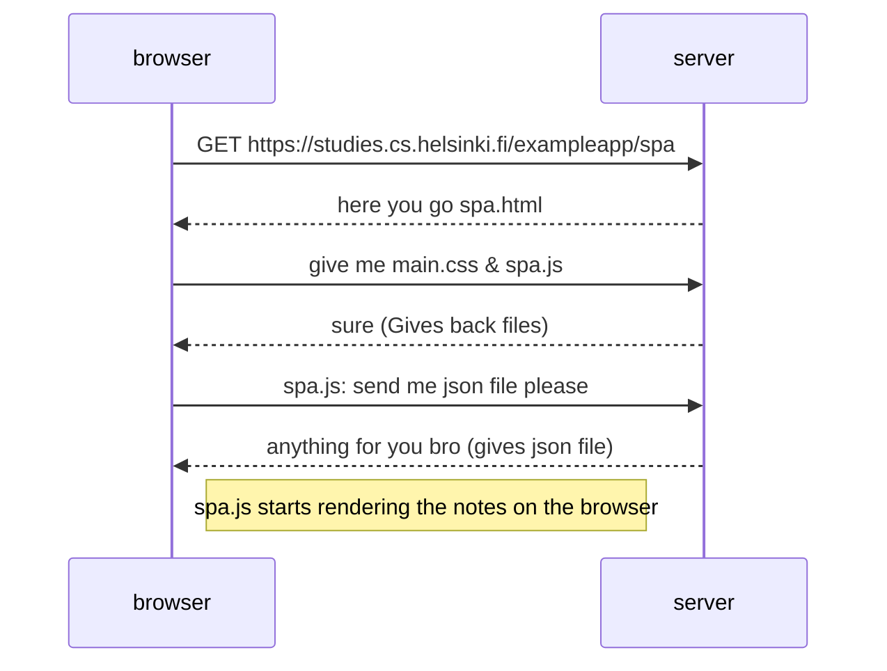

```mermaid
sequenceDiagram

participant browser
participant server

browser->>server: GET https://studies.cs.helsinki.fi/exampleapp/spa

server-->>browser: here you go spa.html

browser->>server: give me main.css & spa.js

server-->>browser: sure (Gives back files)

browser->>server: spa.js: send me json file please

server-->>browser: anything for you bro (gives json file)

Note right of browser: spa.js starts rendering the notes on the browser

```

